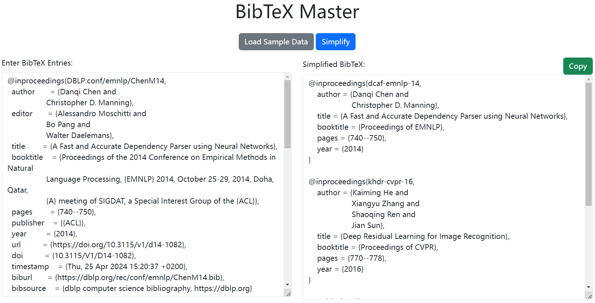

# MasterBib

MasterBib is a Flask-based web application designed to master the simplification and formatting of BibTeX entries for academic publications. It enables users to efficiently streamline their BibTeX data by abbreviating conference names and removing unnecessary fields, positioning itself as the master tool in BibTeX management.

Here is an example of how the application looks:

## Features

- **Simplify BibTeX**: Master the art of converting verbose BibTeX entries into a simplified format with conference abbreviations.
- **Load Default BibTeX**: Users can load a predefined BibTeX from `default.bib` to witness the functionality in action.
- **Update Conference List**: Easily add new conference abbreviations and full names directly to `conferences.json`.
- **Automated Sorting**: Automatically re-sort the conference list by name length to ensure accurate abbreviation mapping.

## Getting Started

Follow these steps to set up and run MasterBib on your local machine:

### Prerequisites

Ensure you have Python installed on your system. This project was developed with Python 3.8, but it should be compatible with other versions of Python 3.

### Installation

1. **Clone the Repository**

   Clone the project by copying its URL from your repository and using the git clone command followed by the URL. Navigate into the project directory with `cd MasterBib`.

2. **Install Dependencies**

   Install the required Python libraries by running `pip install -r requirements.txt`.

### Usage

1. **Start the Web Application**

   Launch MasterBib by running `python main.py`.

2. **Access the Web Interface**

   Open your web browser and type `http://localhost:5000` in the address bar. Here, you can input your BibTeX data and click on the "Simplify" button to format it.

3. **Load Simple BibTeX**

   Use the "Load Simple Data" button on the web interface to see how MasterBib processes a preloaded BibTeX file.

### Managing Conference Abbreviations

To add new conferences or update existing ones:

1. **Edit the `conferences.json` File**

   Modify `conferences.json` by adding new entries in the format `"ABBREVIATION": "Full Conference Name"`. For example, add `"AAAI": "Association for the Advance of Artificial Intelligence"`.

2. **Sort the Conference List**

   Update the sorted list of conferences by running `python sort.py`.

3. **Restart the Application**

   After sorting the conferences, restart MasterBib by running `python main.py` to see the changes in action.

## Contributing

We welcome contributions to MasterBib! Feel free to fork the repository and submit pull requests.

## License

This project is licensed under the MIT License - see the LICENSE.md file for details.
